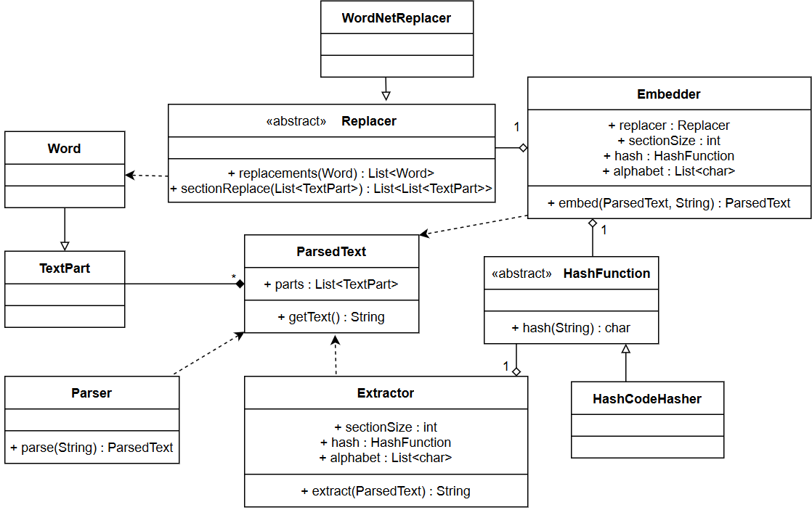

# A Novel System for Semantic Steganography

Steganography is the practice of concealing a message within some other carrier or cover message. It is used to allow the sending of hidden information through communication channels where third parties would only be aware of the explicit information in the carrier message.
This is our implementation of a system of text steganography that can be classified as pure steganography. It uses the redundancy in language semantics as the space for the hidden message and improves on existing algorithms by not requiring the message receiver to be aware of the specific redundancies of any cover message.

## Usage

To use:
> cd src

To compile:
> javac semsteg/*.java

To embed a message:
> java semsteg.Main covertext.txt hidden_message.txt alphabet.txt section_size output_file.txt

To extract a message:
> java semsteg.MainExtract stegotext.txt alphabet.txt section_size output_file.txt

## Implementation

Details on the system and it's implementation are available on the documents folder.
The following is a simplified UML diagram of the structure of the document.

